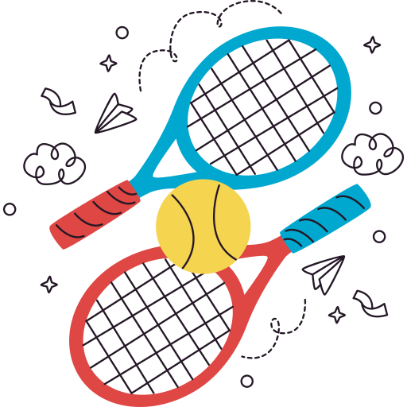

La Trinité | School Spirit          

[La Trinité | Benjamin Bonneton & Ivan Hamelin](#)

*   [Home](#home)
*   [Events](#event)
*   [Celebrations](#celebration)
*   [More](#more)

##### The high school spirit of La Trinité

#### Events

[

* * *

#### Sports Day

](#popup1)

Sports Day
----------

[×](#event)

In order to get to know each other better while having fun, a sports day is organized at the beginning of the year.  
  
Many sports are organized in the form of competitions, each class is united to face the others.  
  
A meal is organized for each class according to a specific theme.

[

* * *

#### Students Club

](#popup2)

Students Club
-------------

[×](#event)

Each year a team is elected which represents the student club.  
  
The club is present to organize events throughout the year.  
  
It also allows students to get out of the work atmosphere and have fun from time to time to release pressure.

[

* * *

#### Integration Day

](#popup3)

Integration Day
---------------

[×](#event)

At the start of the year, an integration day is organized in the form of an orienteering race.  
  
Each point indicated on the map is associated with a presentation of each of the school's activities.  
  
This allows students to learn more about their establishment and all the activities offered there.

#### Celebrations

[

* * *

#### Christmas

](#popup4)

Christmas
---------

[×](#celebration)

A special Christmas event is organized in the establishment each year.

[

* * *

#### Valentine's Day

](#popup5)

Valentine's Day
---------------

[×](#celebration)

On Valentine's Day, the student club distributes flowers for students to give each other anonymously.

[

* * *

#### Carnival

](#popup6)

Carnival
--------

[×](#celebration)

Carnival is an event organized by the student club, all students dress up for a day in the costume of their choice.

#### More

[

* * *

#### Sports Section

](#popup7)

Sports Section
--------------

[×](#more)

A sports section is organized for volunteers every Wednesday.  
Different sports are offered, the goal is to have fun together and to create better team cohesion by playing sports.

[

* * *

#### International Travel

](#popup8)

International Travel
--------------------

[×](#more)

Some trips abroad are also organised in order to improve the students’ level in foreign languages and develop relationships with exchange students.

[

* * *

#### Agora

](#popup9)

Agora
-----

[×](#more)

Our school also features a unique lesson once a week : ‘Agora’.  
It is named after a central public place in ancient greece’s city states.  
This was the place citizens could talk all together about politics and have debates.  
  
‘Agora’ is a lesson about how to talk in front of people and have debates.  
A few times a year, ‘Grand Agoras’ take place in the debate hall and everyone is invited to debate about specific subjects generally linked to actuality.

*   [Home](#)
*   [Events](#event)
*   [Celebrations](#celebration)
*   [More](#more)

Ensemble scolaire Fénelon La Trinité
